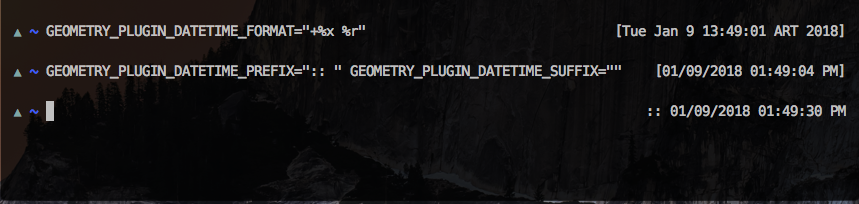

# Geometry datetime

[Geometry](https://github.com/geometry-zsh/geometry) datetime plugin. Shows datetime (`date` unix command) in your prompt.

## Installation

    antigen bundle desyncr/geometry-datetime

## Configuration

    GEOMETRY_PLUGIN_DATETIME_FORMAT=${GEOMETRY_PLUGIN_DATETIME_FORMAT:-""}
    GEOMETRY_PLUGIN_DATETIME_PREFIX="["
    GEOMETRY_PLUGIN_DATETIME_SUFFIX="]"
